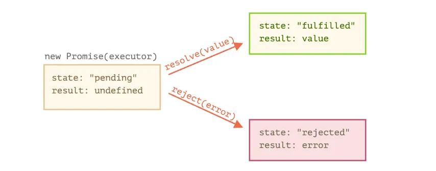
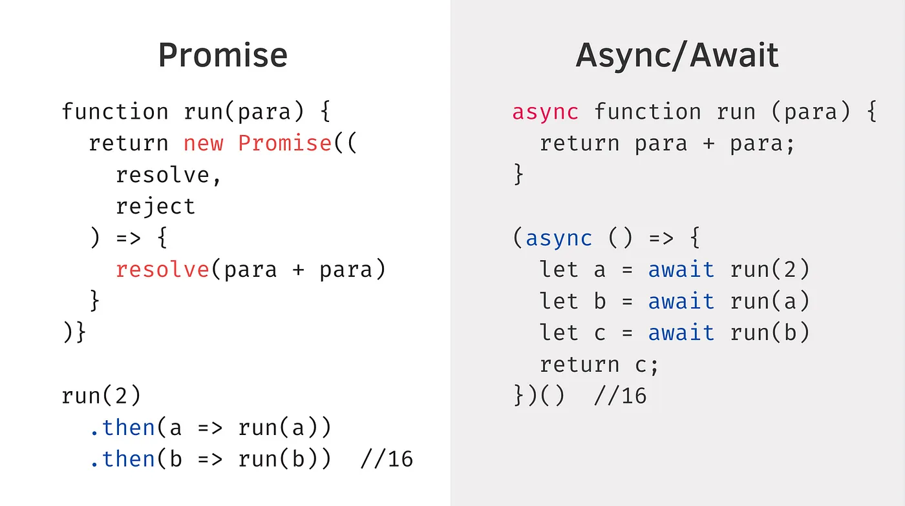

---

sidebar_position: 1
tags:

- callbacks
- promise

---

# Callbacks & Promise

A callback function is a function passed into another function as an argument, so a callback is a function will be executed after parent function is executed

## Callback

```jsx
function func1(x) { alert(x); }  
// 用 func1 當作參數傳入函式 func2
function func2(var1, callback) {     
    callback(var1);  
}
func2(2, func1);
```

## Promise

The Promise object represents the eventual completion (or failure) of an asynchronous operation and allow us to work with the results.
Promises have three states: `pending`, `fulfilled` or `rejected`.

Promises help you naturally handle errors, and write cleaner code by not having callback parameters.

Promise 是一個表示非同步運算的最終 完成 或 失敗 的物件。Promise 物件會有三種狀態:：pending 初始狀態 、 fulfilled 表示操作成功地完成 、 rejected 表示操作失敗。如果我們需要依序串連執行多個 Promise 功能的話，可以透過 .then() 來做到。



```jsx
var p = new Promise(function(resolve, reject) {
    // Do an async task and then...
    if(/* good condition */) {
        resolve('Success!');
    } else {
       reject('Failure!');
    }
});

p()
  .then(() => {
      /* do something with the result */
  })
  .catch(() => {
      /* error */
  })
 .finally(() => {
    /* runs when the promise is settled, 
       doesn't matter successfully or not 
       他在 promise 發生後一開始就被觸發
    */
  })
```

Advance Exercise

<https://medium.com/hannah-lin/%E9%9D%A2%E8%A9%A6-%E8%80%83%E9%A9%97%E4%BD%A0%E5%B0%8D-promise-%E7%9A%84%E7%86%9F%E5%BA%A6%E4%B9%8B%E9%80%B2%E9%9A%8E%E6%87%89%E7%94%A8%E9%A1%8C-6eda0dd0d767>

### 延伸考題 What’s about async?



The async function is syntactic sugar for promise.

async/await 其實是 promise 語法糖，讓你可以用更簡潔的方法達到非同步。(async function 本身就會回傳 promise)

用比較實務去 fetch API 就會如以下 (react Hook 為範例)

```jsx
const [lists, setLists] = useState([])
useEffect(() => {
    getPosts()
},[]) 
 

// promise
const getPosts = () => {
    fetch(`https://jsonplaceholder.typicode.com/posts`)
    .then( res => res.json())
    .then(json => {
      setLists(json)
    })    
}

// asyn await
const getPosts = async () => {
    const obj = await fetch(`https://jsonplaceholder.typicode.com/posts`)
    const json = await obj.json()
    setLists(json)
}
```

兩種寫法結果相同

### 推薦閱讀

英文: Promises, async/await (這有一系列的文章，很推薦閱讀) (<https://javascript.info/async>)
中文: Promise, generator, async與ES6 (Huli 寫的這篇是我四年前學 promise 第一篇看懂的中文文章) (<https://blog.huli.tw/2015/08/26/javascript-promise-generator-async-es6/>)
