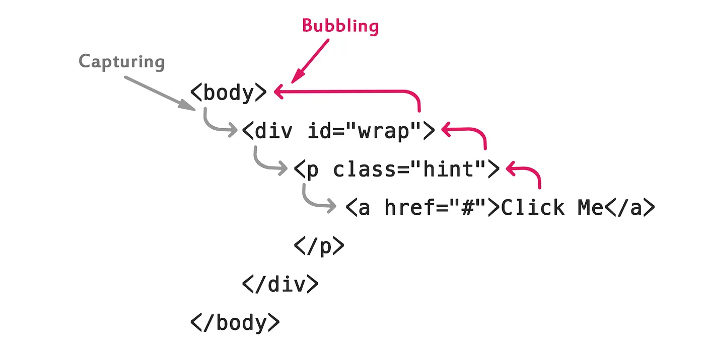

---

sidebar_position: 1
tags:

- bubbling
- event-capturing

---

# Event Bubbling (propagation), Event Capturing

### Bubbling

When an event happens on an element, it first runs the handlers on it, then on its parent, then all the way up on other ancestors.

從啟動事件的元素節點開始，逐層往上傳遞

### Event Capturing

the event goes down to the element.
從最上層的母元素開始，逐層往下傳遞

### Comparison



事件兩者都會執行 ，會先執行 Capturing 再執行 Bubbling

當然你可以提供 addEventListener 第二個參數去補抓順序

If it’s false (default), 會被設定為 `Bubbling`

If it’s true, 會被設定為 `Capturing`

```jsx
var btn = document.getElementById('btn');
btn.addEventListener('click', function(){
  console.log('HELLO');
}, false ); // Bubbling
```

若需要取消 Bubbling 也可以使用 event.stopPropagation()

### 延伸考題: What’s Event Delegation?

If there are many elements inside one parent, and you want to handle events on them — don’t bind handlers to each element. Instead, bind the single handler to their parent and get the child from e.target

Event Delegation是一種運用 Event Bubbling 概念而能減少監聽器數目的方法，將事件處理器綁在目標元素的父元素上進行處理，可以減少大量子事件監聽器的數量

```jsx
// Before using delegated event
let elements = document.querySelectorAll('ul > li > a');
for (let elem of elements) {
    elem.addEventListener('click', function(e){
       console.log(e.target)
      // to something
    })
}

// Attach a delegated event handler
document.getElementById('list').addEventListener('click', function(e){
    if (e.target.tagName == 'a'){
      console.log(e.target)
      // to something
    }
}
```

### 推薦閱讀

英文: Bubbling and capturing, Event delegation： <https://javascript.info/bubbling-and-capturing>, <https://javascript.info/event-delegation>
中文: 重新認識 JavaScript: Day 14 事件機制的原理 、Huli 的 DOM 的事件傳遞機制：捕獲與冒泡 : <https://blog.huli.tw/2017/08/27/dom-event-capture-and-propagation/>
