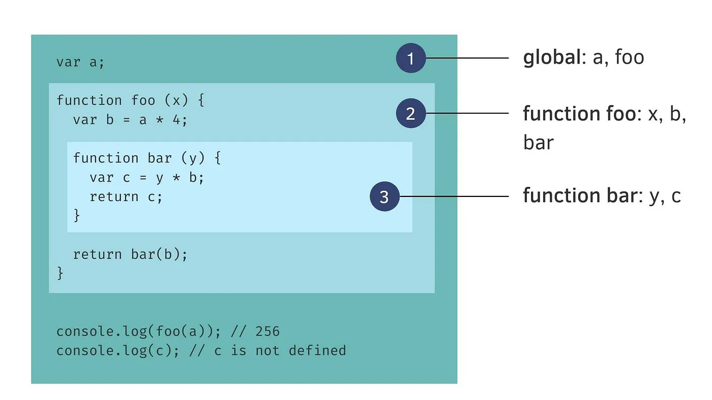
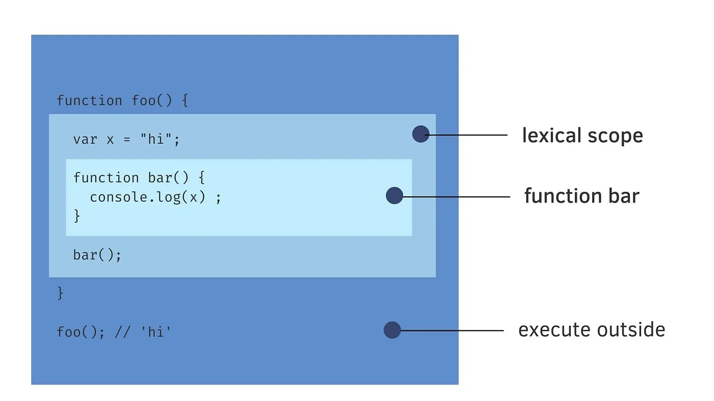

---

sidebar_position: 1
tags:

- scope

---

# Scope

Where and how to look for things. JS have two lexical scopes global and function

變數在程式中可以被存取的範圍，可分為區域變數，全域變數。

# Closure

Closure is when a function “remembers” its lexical scope even when the function is executed outside that lexical scope. The combination of the function and it’s environment is known as a closure.

閉包是個捕捉了外部函式變數（或使之繼續存活）的函式，它包含了一個函式，以及函式被建立時所在的環境

基本上函式離開執行環境時，也會同時將佔用的記憶體空間給釋放出來。例如以上 x變數應該在執行完畢就會在 memory (記憶體) 中被清掉。但因為 closure 特性此 x變數還會繼續被保留
